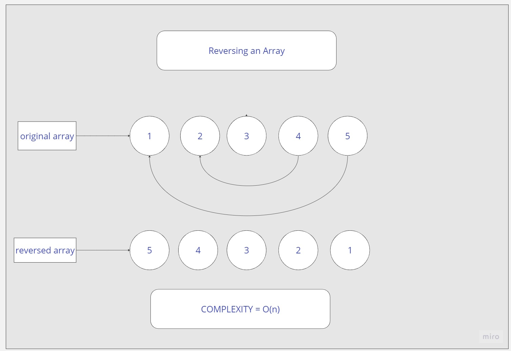

# array-reverse

<!-- Description of the challenge -->

## We want to use our language to implement how to reverse an array

---

## Whiteboard Process

<!-- Embedded whiteboard image -->

---

## Approach & Efficiency

<!-- What approach did you take? Why? What is the Big O space/time for this approach? -->

The approch i took is to use a temp variable to store a value and use start position and end to start replacing them and hench reversing the values of the array, The big O is O(n)

---

## Solution

<!-- Show how to run your code, and examples of it in action -->

psuduecode process

reverseArray(arr) {
start = 0
end = arr.length - 1
while (start < end) {
// swap arr[start] and arr[end]
let temp = arr[start]
arr[start] = arr[end]
arr[end] = temp
start = start + 1
end = end - 1
}
}

---

_Murad Dabbous_
